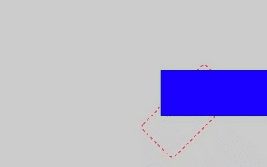
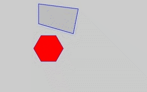
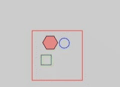
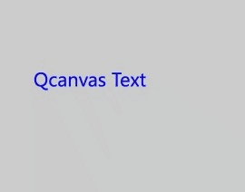
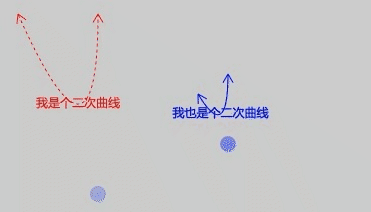
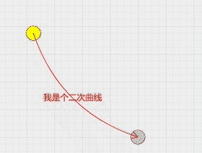
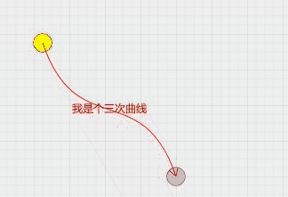
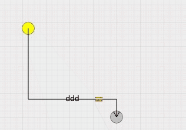

# Qcanvas

文档同步更新
http://lizhicheng99.gitee.io/qcanvas-api-1.0 
https://zhicheng99.github.io/Qcanvas-API/ 

框架引入方法
> ##### 方法一
> npm安装
>> 执行：npm install qcanvas
>> 页面引用： import {Qcanvas} from 'qcanvas';

> ##### 方法二
> 使用script标签直接引用

> 示例展示
https://zhicheng99.github.io/qcanvas/
部分示例载图

线

文本

矩形

圆

多边形

图片

精灵图

动画

修改元素层级

layer中的元素层级

拖动限制范围 (现只支持Qarc、Qpolygon、Qrect实例)

右键菜单

二次曲线

二次曲线控制点计算

三次曲线

三次曲线控制点计算

折线连接元素（横向）

折线连接元素（竖向）

折线连接元素（横向）拖动

折线连接元素（竖向）拖动

rect缩放 旋转

rect缩放 旋转 算法

